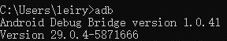
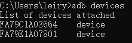

# CuPerFuzzer+

This repo is the prototype implementation for the following papers. Please read them before running this project.

\[Conference Version\] Rui Li, [Wenrui Diao](https://diaowenrui.github.io/), Zhou Li, Jianqi Du, and Shanqing Guo. Android Custom Permissions Demystified: From Privilege Escalation to Design Shortcomings. The 42nd IEEE Symposium on Security and Privacy, San Francisco, CA, USA. May 23-27, 2021. [\[PDF\]](https://diaowenrui.github.io/paper/oakland21-li.pdf)

\[Extension Version\] Rui Li, [Wenrui Diao](https://diaowenrui.github.io/), Zhou Li, Shishuai Yang, Shuang Li, and Shanqing Guo. Android Custom Permissions Demystified: A Comprehensive Security Evaluation. IEEE Transactions on Software Engineering, 2021. [\[Link\]](https://ieeexplore.ieee.org/document/9573482)

------

A black-box fuzzer to detect custom permission related privilege escalation vulnerabilities in Android.

- Default running environment: `Windows 10`.
- Default test phone model: `Google Pixel 2`.
- Default test Android OS version: `Android 10`.

------

### **Test App Generation**: 

- `generate_apk.py`: build test apps.
- `sim`: the test app template for building test apps against the *single-app* mode (i.e., apps both declaring a custom permission and requesting permissions).
- `declared`: the test app template for building test apps against the *dual-app* mode (i.e., apps only declaring a custom permission).
- `simulateclick.apk`: the app requesting permissions against the *dual-app* mode.
- `declare.jks`: the certificate for signing test apps against the *dual-app* mode (key store password, key password: 123456, key alias: key0).
- `request.jks`: the certificate for signing test apps against the *single-app* mode (key store password, key password: 123456, key alias: key00).

To avoid the time cost of real-time app generation, you can generate test apps and store them in a dataset in advance.

### **Fuzzing Test**:

- `normal-1.py`: generate and execute the test case **without the OS update operation** in the *single-app* mode.
- `normal-2.py`: generate and execute the test case **without the OS update operation** in *dual-app* mode.
- `upgrade-1.py`: generate and execute the test case **containing the OS update operation** in the *single-app* mode.
- `upgrade-2.py`: generate and execute the test case **containing the OS update operation** in the *dual-app* mode.

### **Critical Path Extraction**:
- `critical_path.py`: extract critical paths from effective cases.

------

### **Running Environment Setup**:

- Install Python 3.8 ([https://www.python.org/](https://www.python.org/)).
- According to your phone model, compile two versions of Android OS images based on the source code of AOSP Android 9 and 10. Note that you should:
  - In `frameworks/base/packages/SettingsProvider/res/values/defaults.xml`, change the value of `def_screen_off_timeout` to **2147483646**, and change the value of `def_lockscreen_disabled` to **true**.
  - In `/build/make/core/main.mk`, change the value of `ro.adb.secure`  to **0**.
  - Build the image with the `userdebug` type option.

So that the compiled Android OS images can disable the screen lock, keep `adb` always open, and skip the `adb` authorization step.

References for building Android :

(1) [Establishing a Build Environment](https://source.android.com/setup/build/initializing)

(2) [Downloading the Source](https://source.android.com/setup/build/downloading)

(3) [Building Android](https://source.android.com/setup/build/building)

- Add the `platform-tools` (platform-tools_r30.0.3-windows/platform-tools) to your `PATH` environment variable and ensure that the `adb` and `fastboot` commands  can be executed successfully.

  
  
  

You can download the latest `platform-tools` for Windows, Mac, or Linux at  [https://developer.android.com/studio/releases/platform-tools](https://developer.android.com/studio/releases/platform-tools).

- Install the latest `JDK` and add it to your `PATH` environment variable. Make sure that the `jarsigner` command can be executed successfully.
  
  

`JDk` download link: [Java Downloads | Oracle](https://www.oracle.com/java/technologies/downloads/)

------

### **Notes**:

- Replace the paths referred to in these python files with your own paths.

- Replace the value of `device_id` in these  python files with your devices' IDs. Execute `adb devices` to get them.

  	

- Adjust the `reset()` function in `normal-1.py` ,  `normal-2.py`, and `critical_path.py` based on the location of the button `Erase all data` of your test phone.

- Adjust the value of `sleep.wait` in these python files based on your test phone's response time, such as the reboot time.

